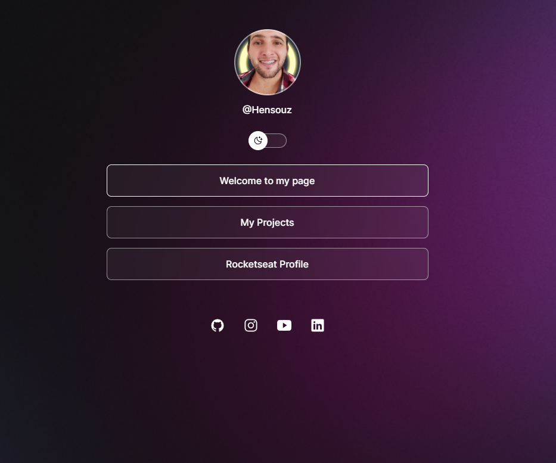

<h1 align="center"> DevLinks </h1>

Programa orientado pela Rocketseat para desenvolvimento de tecnologias WEB.

  <a href="#-tecnologias">Tecnologias</a>&nbsp;&nbsp;&nbsp;|&nbsp;&nbsp;&nbsp;
  <a href="#-projeto">Projeto</a>&nbsp;&nbsp;&nbsp;|&nbsp;&nbsp;&nbsp;
  <a href="#memo-licença">Licença</a>

  

 

  

## 🚀 Tecnologias

Esse projeto foi desenvolvido com as seguintes tecnologias:

- HTML e CSS
- JavaScript
- Git e Github
- Figma

## 💻 Projeto

O DevLinks é um agregador de links para usar como cartão de visitas online.

## :memo: Licença

Esse projeto está sob a licença MIT.

# Considerações
Meu primeiro projeto no GitHub é uma aplicação web com o propósito de apresentar um pequeno portifólio. Este projeto foi criado como parte do meu aprendizado em algumas tecnologias citadas a cima 🤯. Sinta-se à vontade para contribuir ou fornecer feedback! 🤩

